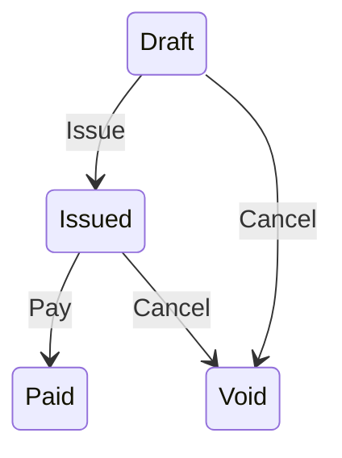

# Hoare

[](https://github.com/leftstanding/hoare/actions/workflows/ci.yml)
[](https://hex.pm/packages/hoare)
[](https://github.com/leftstanding/hoare/blob/master/LICENSE)

Declared state transitions as pre/post contracts.

Most records carry a status, and most bugs around one are the same few: a
change made from a state it should not have started in, a side effect that
happened although the change did not, two requests racing over one record.
Hoare makes the transition a declaration, the states it leaves, the state it
reaches, the guards that must hold and the effects it performs, and runs every
declaration the same way. `{from, guards} body {to}` is a Hoare triple;
running it keeps one law: **a run ends in `to` or leaves the record in `from`,
never between.**

```
check    from ▸ guards                  on the record the caller resolved
perform  effects                        IO; bare = idempotent, {run, undo} = reverted on failure
commit   lock ▸ read ▸ check ▸ body ▸ write to ▸ read ▸ assert to      one transaction
```

No processes, no DSL beyond three `use` macros, no dependencies. Results are
plain `{:ok, value} | {:error, reason}` tuples throughout.

## Installation

```elixir
def deps do
  [
    {:hoare, "~> 0.4"}
  ]
end
```

Add `import_deps: [:hoare]` to `.formatter.exs`.

## States

A state is a module: the status that tags a record, the reason when it does
not, and the properties that refine the tag. Matching a record builds a struct
of *witnesses*, the record plus whatever the properties extracted, so nothing
downstream has to look again.

```elixir
defmodule Invoice.State do
  import Hoare.State, only: [defstate: 2, defstate: 3]

  defstate Draft, status: :draft
  defstate Paid, status: :paid
  defstate Void, status: :void

  defstate Issued, status: :issued, witnesses: [:lines], preloads: [:lines] do
    @impl Hoare.State
    def properties, do: [&billable_lines/1]

    defp billable_lines(%__MODULE__{record: %{lines: []}}), do: {:error, :no_lines}
    defp billable_lines(%__MODULE__{record: %{lines: lines}} = state), do: {:ok, %{state | lines: lines}}
  end
end

Hoare.State.match(Invoice.State.Issued, invoice)
#=> {:ok, %Issued{record: invoice, lines: [...]}} | {:error, :not_issued} | {:error, :no_lines}
```

`:missing` defaults to `:not_<status>`. A state that needs its own file is
`use Hoare.State, status: ...` in a module; one that needs neither macro
implements the `Hoare.State` behaviour and defines the struct itself. The
state one transition reaches is the module another leaves, so the graph is
nominal and inspectable.

A tag is read from `:status` unless `field:` names another column, and a state
that declares no `status:` is untagged: it is its properties.

```elixir
defstate Reserved, witnesses: [:reservation], preloads: [:reservation] do
  @impl Hoare.State
  def properties, do: [&reserved/1]

  defp reserved(%__MODULE__{record: %{reservation: nil}}), do: {:error, :not_reserved}
  defp reserved(%__MODULE__{record: %{reservation: r}} = state), do: {:ok, %{state | reservation: r}}
end
```

Records with no status column live here: nothing tags them, so the properties
are the state. A transition into an untagged `to` writes no tag; the body's
own writes are the move, and `to` is asserted on the re-read as always.

The module holding the states gains `all/0` and `classify/1`:

```elixir
Unit.State.classify(unit)
#=> {:ok, %Reserved{...}} | {:error, :unclassified} | {:error, {:ambiguous, [Reserved, Picked]}}
```

Exactly one match is "the states are exhaustive and exclusive" made
executable. Run it over the rows before moving a writer onto a transition.

## Transitions

```elixir
defmodule Invoice.Pay do
  use Hoare.Transition,
    from: [Invoice.State.Issued],
    to: Invoice.State.Paid,
    ctx: [:payment_method, :charge]

  import Hoare.Result, only: [ensure: 2]

  @impl Hoare.Transition
  def guards, do: [ensure(&amount_due?/1, :nothing_due), &chargeable_method/1]

  @impl Hoare.Transition
  def effects, do: [&cancel_reminder/1, {&charge/1, &refund/1}]

  @impl Hoare.Transition
  def stranded(ctx, reason), do: Alerts.reminder_cancelled_unpaid(ctx.record, reason)

  defp amount_due?(%{record: invoice}), do: Decimal.positive?(invoice.balance)
  ...
end
```

The context is the module's struct: `record`, the record whose status moves;
`state`, filled by matching `from`; and the `:ctx` keys. Every arrow is
`ctx -> {:ok, ctx} | {:error, reason}` and may refine the context it returns.

- **Guards** decide whether the transition may run. `Hoare.Result.ensure/2`
  lifts a predicate into one; a guard that finds something worth keeping puts
  it in the context.
- **Effects** are the IO that cannot join a database transaction. A bare
  effect must be idempotent, because the recovery for a failed run is to run
  again. An effect paired with an undo is reverted, newest first, when
  anything after it fails.
- **`stranded/2`** is optional. It is told when a run fails after a bare
  effect, the one case that leaves something behind: alert, or queue the
  retry.

The module that owns the records runs the transition, supplying its own writes
as the body and the store:

```elixir
def pay(invoice_id, payment_method) do
  with {:ok, invoice} <- Invoices.fetch(invoice_id, Pay.preloads()),
       {:ok, paid} <- Pay.run(%Pay{record: invoice, payment_method: payment_method}, &record_payment/1, store: Repo),
       do: {:ok, paid.record}
end

defp record_payment(%Pay{record: invoice, charge: charge}), do: Payments.insert(invoice, charge)
```

`Pay.preloads()` is what the states and the transition declared, the same list
the commit re-reads with. `Pay.check/1` runs the precondition alone, to decide
whether to offer the action. `Pay.from_statuses/0` serves queries.

### The commit

In one transaction, under the store's lock on `{schema, id}` (or
`opts[:lock]`), the commit reads the record again with the declared preloads,
runs the whole check on it, runs the body on the re-checked context, writes
`to`'s tag through the schema's `changeset/2` (nothing, when `to` is
untagged), and asserts `to` on a second read. So:

- **Guards run twice**, before the effects and again under the lock. A guard
  is a function of the context alone and writes only keys no effect writes.
  Whatever the caller resolved into the context is no fresher the second
  time: a condition that must hold under the lock reads the record, with what
  it reads named in `preloads`.
- A record already in `to` is a concurrent run of the same transition. It
  converges as `{:ok, record}` when every completed effect was bare, and is
  `{:error, :status_changed}`, with the undos run, otherwise.
- A record in neither is `{:error, :status_changed}`; one that vanished is
  `{:error, :not_found}`. `Hoare.Transition.error/1` adds both to a
  transition's own reasons.
- A body that leaves the record outside `to` raises, rolling back.

### Without the macro

`use Hoare.Transition` assembles a `%Hoare.Transition{}` and calls
`Hoare.Transition.run/4`. The struct is the core and can be built or varied
directly, a resume path that skips an announcement, say:

```elixir
Hoare.Transition.run(%{Pay.transition() | effects: [&charge_again/1]}, ctx, body, store: Repo)
```

## Intake

A record has to arrive before it can move. `Hoare.Intake` is a transition
whose subject changes: `from` is a state of the payload, an untagged state
over the incoming map, and `to` the state of a record that does not exist
yet.

```elixir
defmodule ValidInvoice do
  use Hoare.State, witnesses: [:number, :account_id, :external_id]

  @impl Hoare.State
  def properties, do: [&numbered/1, &accounted/1]
end

defmodule Receive do
  use Hoare.Intake,
    from: [ValidInvoice],
    to: Issued,
    schema: MyApp.Invoice,
    key: [:number, :account_id],
    identity: [:external_id]
end

Receive.run(%Receive{record: params}, &insert_invoice/1, store: Repo)
```

Validation stops being a step before the transition and becomes its
precondition, in the same vocabulary as every other state, and the way in
appears on the graph rather than as an arrow from nowhere.

`key` and `identity` name witnesses of the payload state, which are read as
fields of the record too: the key is the natural key the datastore enforces,
and identity is what tells the same payload arriving twice from two things
colliding on one key. The commit locks on `{schema, key}` and reads by it,
so:

- nothing there: the body creates the record, and `to` is asserted on what it
  created;
- a row matching `identity`: the same payload again, converging as
  `{:ok, record}` when every completed effect was bare, and
  `{:error, :already_exists}`, with the undos run, otherwise;
- a row that does not match: `{:error, :conflict}`.

The found row is returned as it stands, and `to` is asserted only on the row
the body creates. A record has a life after it arrives, and the transitions
that moved it are what answer for where it is now; re-asserting `to` here
would refuse a replay for having been fulfilled. What intake promises is
narrower and exact: a record exists under this key, it is this same thing,
and it was in `to` when it was created. That last clause holds only while
every writer of the record is declared.

## Store

`Hoare.Store` is the four operations the commit needs:
`transact_with_lock/2`, `read/3`, `read_by/3` and `update/1`. An `Ecto.Repo`
has the last already:

```elixir
defmodule MyApp.Repo do
  use Ecto.Repo, otp_app: :my_app, adapter: Ecto.Adapters.Postgres
  @behaviour Hoare.Store

  @impl Hoare.Store
  def transact_with_lock(lock, fun) do
    transact(fn ->
      query!("SELECT pg_advisory_xact_lock($1)", [:erlang.phash2(lock)])
      fun.()
    end)
  end

  @impl Hoare.Store
  def read(schema, id, preloads) do
    if record = get(schema, id), do: {:ok, preload(record, preloads)}, else: {:error, :not_found}
  end

  @impl Hoare.Store
  def read_by(schema, key, preloads) do
    if record = get_by(schema, key), do: {:ok, preload(record, preloads)}, else: {:error, :not_found}
  end
end
```

Nothing in Hoare depends on Ecto: the record is any struct with `id` and the
fields its states read, whose module has a `changeset/2` the store's
`update/1` accepts.

## Testing

`Hoare.Store.Memory` keeps records in the test process, so a transition's
contract is tested without a database:

```elixir
invoice = Memory.put(%Invoice{id: 1, status: :issued, lines: [line], balance: Decimal.new(10)})

assert {:ok, %Pay{record: %Invoice{status: :paid}}} =
         Pay.run(%Pay{record: invoice, payment_method: card}, &{:ok, &1}, store: Memory)
```

Guards and properties are plain functions of data: `Pay.check/1` and
`Hoare.State.match/2` need no store at all.

## Graph

```elixir
Hoare.Graph.edges([Invoice.Issue, Invoice.Pay, Invoice.Cancel])
#=> [{Draft, Issue, Issued}, {Issued, Pay, Paid}, {Draft, Cancel, Void}, {Issued, Cancel, Void}]

Hoare.Graph.leaving([Invoice.Issue, Invoice.Pay, Invoice.Cancel], Invoice.State.Draft)
#=> [Invoice.Issue, Invoice.Cancel]

Hoare.Graph.to_mermaid([Invoice.Issue, Invoice.Pay, Invoice.Cancel])
```



Assert on `edges/1` in a test and a change to the lifecycle becomes a
deliberate diff.

## Results

`Hoare.Result` holds the few combinators the runner is built from: `bind/2`,
`kleisli/1`, `ensure/2`, `tap_ok/2`, `tap_error/2`, `map_error/2`. Tagged
tuples throughout; nothing is wrapped.
